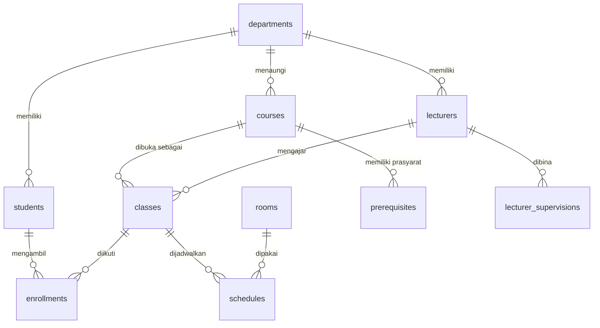

# 🗃️ Latihan JOIN Query SQL: Sistem Akademik

Kumpulan jawaban **25 soal JOIN query SQL** pada basis data akademik (mahasiswa, dosen, mata kuliah, kelas, ruang, jadwal, KRS, prasyarat, dan pembinaan dosen). Repository ini berisi skrip pembuatan tabel, data contoh, dan seluruh query jawaban dalam satu file.

## 📋 Informasi Tugas

| | |
|---|---|
| **Nama** | Angga Fadzar |
| **NIM** | 2306201 |
| **Kelas** | SIK A5 |
| **Mata Kuliah** | Bisnis Intelijen |
| **Dosen Pengampu** | Willdan Aprizal Arifin, S.Pd., M.Kom |

## 📁 Isi Repository

```
.
├── Angga_Fadzar_2306201.sql   # DDL + data contoh + 25 query JOIN
└── README.md
```

File SQL terdiri dari tiga bagian berurutan:

1. **DDL**: pembuatan 10 tabel beserta *primary key* dan *foreign key*.
2. **Data contoh**: `INSERT` untuk semua tabel.
3. **Jawaban**: 25 query JOIN bernomor, masing-masing diawali komentar soal.

## 🧩 Skema Database



| Tabel | Fungsi | Kunci |
|---|---|---|
| `departments` | Data departemen/prodi | PK `dept_id` |
| `students` | Data mahasiswa | PK `student_id`, FK `dept_id` |
| `lecturers` | Data dosen | PK `lect_id`, FK `dept_id` |
| `courses` | Data mata kuliah (kode, judul, SKS) | PK `course_id`, `course_code` unik, FK `dept_id` |
| `classes` | Penyelenggaraan mata kuliah per semester dan dosen | PK `class_id`, FK `course_id`, `lect_id` |
| `rooms` | Data ruang dan kapasitas | PK `room_id` |
| `schedules` | Jadwal kelas di ruang (hari, jam mulai, jam selesai) | PK `schedule_id`, FK `class_id`, `room_id` |
| `enrollments` | KRS (relasi *many-to-many* mahasiswa dan kelas, beserta nilai) | PK gabungan `(student_id, class_id)` |
| `prerequisites` | Prasyarat mata kuliah (*self-reference* ke `courses`) | PK gabungan `(course_id, prereq_id)` |
| `lecturer_supervisions` | Hierarki pembinaan dosen (*self-reference* ke `lecturers`) | PK gabungan `(lect_id, supervisor_id)` |

### Data Contoh

| Tabel | Jumlah Baris |
|---|---|
| `departments` | 3 (Sistem Informasi Kelautan, Ilmu Komputer, Biologi Kelautan) |
| `students` | 6 |
| `lecturers` | 5 |
| `courses` | 6 |
| `classes` | 6 (semester `2025-1`) |
| `rooms` | 4 |
| `schedules` | 6 |
| `enrollments` | 10 (sebagian bernilai `NULL`) |
| `prerequisites` | 2 |
| `lecturer_supervisions` | 4 |

## 📝 Daftar Soal dan Teknik

| No | Soal | Teknik |
|---|---|---|
| 1 | Nama mahasiswa dan departemennya | `INNER JOIN` |
| 2 | Kelas beserta mata kuliah dan dosen pengajar | `INNER JOIN` 3 tabel |
| 3 | Mahasiswa yang mengambil Sistem Basis Data | `INNER JOIN` berantai + `WHERE` |
| 4 | Jadwal lengkap kelas (hari, jam, ruang) | `INNER JOIN` 4 tabel |
| 5 | Jumlah mahasiswa per departemen pada semester 2025-1 | `LEFT JOIN` + `COUNT(DISTINCT)` + `GROUP BY` |
| 6 | Kelas yang dosennya satu departemen dengan mata kuliahnya | `INNER JOIN` dengan dua alias `departments` |
| 7 | Mahasiswa SIK yang mengambil kelas di luar departemennya | `INNER JOIN` + kondisi `!=` |
| 8 | Mata kuliah beserta prasyaratnya | *Self-join* `courses` via `prerequisites` |
| 9 | Dosen dan dosen pembinanya | *Self-join* `lecturers` |
| 10 | Mahasiswa dan kelas yang nilainya belum keluar | `INNER JOIN` + `IS NULL` |
| 11 | Mahasiswa sedepartemen dengan SIG Kelautan yang tidak mengambilnya | `INNER JOIN` + `NOT IN` (subquery) |
| 12 | Jumlah kelas dan total kapasitas ruang per hari | `INNER JOIN` + `COUNT`, `SUM`, `GROUP BY` |
| 13 | Total SKS per mahasiswa | `INNER JOIN` + `SUM` |
| 14 | Mata kuliah lintas prodi (departemen MK ≠ departemen dosen) | `INNER JOIN` + `!=` |
| 15 | Jumlah peserta, kapasitas ruang, dan status PENUH/TERSEDIA | `LEFT JOIN` + `COUNT` + `CASE WHEN` |
| 16 | KRS tiap mahasiswa semester 2025-1 | `INNER JOIN` + `ORDER BY` |
| 17 | Mata kuliah yang menjadi prasyarat | `INNER JOIN` + `DISTINCT` |
| 18 | Dosen pembina dan jumlah dosen binaannya | `INNER JOIN` + `COUNT` + `GROUP BY` |
| 19 | Mahasiswa, kelas, dan ruang pada hari Senin | `INNER JOIN` 5 tabel |
| 20 | Mata kuliah yang diambil dari departemen berbeda | `INNER JOIN` + `!=` |
| 21 | Semua dosen beserta kelasnya (termasuk yang tidak mengajar) | `LEFT JOIN` |
| 22 | Semua mata kuliah beserta kelas semester 2025-1 | `LEFT JOIN` dengan kondisi pada `ON` |
| 23 | Mata kuliah dan prasyaratnya, termasuk yang tanpa prasyarat | `LEFT JOIN` |
| 24 | Mahasiswa yang mengambil kelas dosen pembinanya | `INNER JOIN` berantai + *self-join* |
| 25 | Pengecekan bentrok ruang pada hari dan jam yang tumpang tindih | *Self-join* `schedules` |

## 🚀 Cara Menjalankan

1. Siapkan DBMS (mis. **MySQL/MariaDB** lewat XAMPP atau Laragon, atau **SQL Server**).
2. Buat database baru, misalnya:

   ```sql
   CREATE DATABASE akademik;
   USE akademik;
   ```

3. Jalankan isi file `Angga_Fadzar_2306201.sql`, baik lewat phpMyAdmin / MySQL Workbench / SSMS, maupun lewat terminal:

   ```bash
   mysql -u root -p akademik < Angga_Fadzar_2306201.sql
   ```

4. Jalankan query soal satu per satu untuk melihat hasilnya.

> **Catatan:** Pada file SQL, pernyataan `CREATE TABLE` dan `INSERT` belum diakhiri tanda titik koma (`;`). DBMS seperti MySQL/MariaDB membutuhkan `;` di akhir tiap pernyataan agar skrip dapat dijalankan sekaligus. Tambahkan `;` bila muncul pesan *syntax error*.

## 🛠️ Konsep yang Dipraktikkan

- `INNER JOIN` dan `LEFT JOIN`
- *Self-join* (prasyarat mata kuliah, hierarki dosen, bentrok jadwal)
- Join berantai lebih dari dua tabel
- Fungsi agregat (`COUNT`, `SUM`) dengan `GROUP BY`
- `CASE WHEN`, `DISTINCT`, `ORDER BY`
- Subquery (`NOT IN`)

---

*Dibuat untuk keperluan tugas mata kuliah Bisnis Intelijen.*
